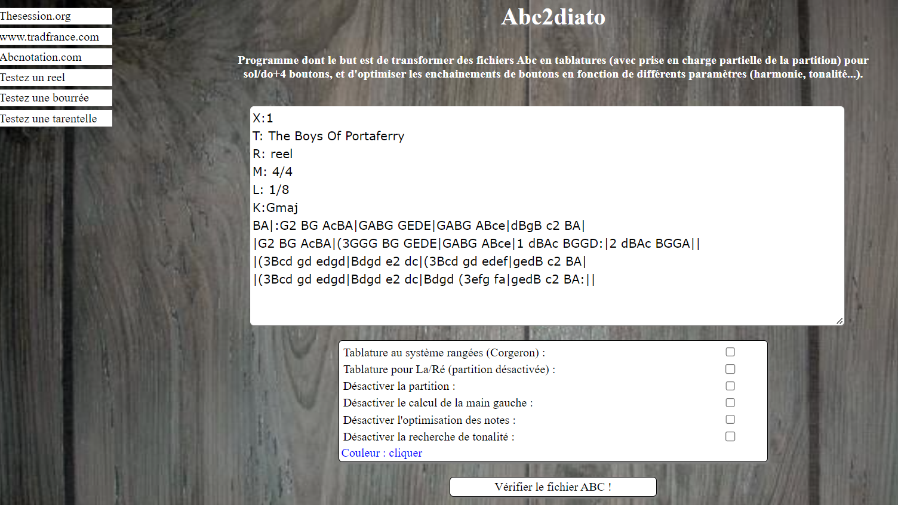
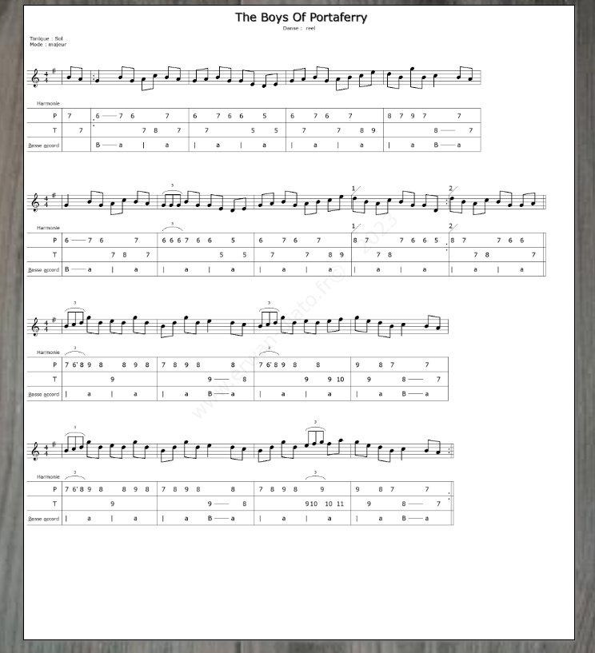

# editeur de tablatures et partitions 

Cette application web en php créé des tablatures pour accordéon diatonique avec partitions à partir de fichiers ABC, très utilisés en musiques traditionnelles, principalement dans les pays anglophones.  
    
Les fichiers ABC sont des fichiers texte avec plusieurs en-têtes d'informations (titre, métrique, tonalité etc) puis les notes de musique au format anglophone. Ils sont conçus comme des mémos facilement échangeables et lisibles sans connaissance du solfège. 

Ce programme - mon premier programme - a été conçu en 2013. Il est en ligne à cette adresse : http://erwan-diato.com/pages/tablatures/editeur_de_tablatures/index.php . 

Une première page permet de tester le programme ou de rentrer un fichier ABC. 



Le traitement est effectué en php, une image est générée avec la bibliothèque Gd, et affichée sur une deuxième page :



Il y a possibilité de télécharger un fichier midi du fichier ABC, l'add-on javascript a été écrit par Paul Rosen : https://paulrosen.github.io/abcjs/overview/purpose.html 


Pour installer le programme : 

``` bash
docker-compose up -d --build
```

Pour installer la base de données : 

``` bash 
docker cp editeur.sql datasite1:editeur.sql   
docker exec -it datasite1 bash   
mysql -u root -p  
create database accordeon;  
exit;   
mysql -u root -p accordeon < editeur.sql  
exit; 
```
Ensuite, l'application est disponible ici : 

> http://localhost:8111/